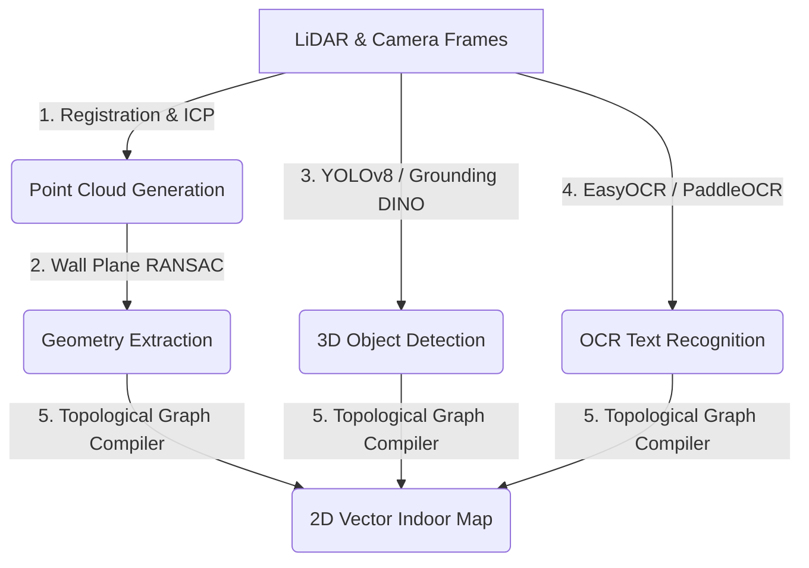

# AI Pipeline Architecture & Technology Recommendations

This document outlines the recommended open-source libraries and models to implement the five core AI steps of the **Hospital Map Extraction** pipeline:

---

## Step 1: Point Cloud Generation & Registration
*Converting sequence of captured camera/depth frames and sensor (IMU) logs into a unified 3D point cloud.*

*   **Recommendation: Open3D (Python)**
    *   **Why**: It is the industry standard for 3D data processing in Python. It includes highly optimized algorithms for point cloud alignment (Iterative Closest Point - ICP), voxel downsampling, outlier removal (statistical and radius), and normal estimation.
    *   **Alternative**: **RTAB-Map** or **ORB-SLAM3** if real-time dense visual SLAM (Simultaneous Localization and Mapping) needs to run on the server using sequence frames.

---

## Step 2: 3D Object Detection (Doors, Signs, Obstacles)
*Identifying and localizing architectural features from coordinates and image streams.*

*   **Recommendation: YOLOv8 / YOLOv10 (Ultralytics) + Grounding DINO**
    *   **Why**: 
        *   **YOLOv8** is exceptionally fast and can detect signs, fire exits, and doors in 2D frames. We can project the 2D bounding boxes into 3D coordinates using the camera intrinsic matrix and LiDAR depth data.
        *   **Grounding DINO** is an open-vocabulary detector. If mappers want to detect custom objects (e.g. "Defibrillator", "Elevator Button") without training a custom model, they can pass textual prompts to Grounding DINO to extract coordinates automatically.
    *   **Alternative**: **PointPillars** (using PyTorch Geometric) to perform 3D object detection directly on raw Point Clouds (commonly used in autonomous driving).

---

## Step 3: OCR Recognition (Signages & Room Numbers)
*Reading text from signs and door plates to automatically identify room names and departments.*

*   **Recommendation: PaddleOCR or EasyOCR**
    *   **Why**:
        *   **PaddleOCR**: Extremely fast and currently has the highest accuracy for multi-language signages, text localization (DBNet), and direction rotation robustness.
        *   **EasyOCR**: Very simple to run, deep-learning based (PyTorch), and easily handles custom vocabulary lists (e.g., medical department terms like "Radiology", "Pediatrics").
    *   **Alternative**: **Tesseract OCR (pytesseract)** (good for black-and-white print, but struggles with skewed angle camera signs).

---

## Step 4: Geometry Extraction (Walls & Corridors)
*Filtering out noise (patients, chairs, equipment) and tracing structural wall outlines.*

*   **Recommendation: RANSAC Plane Segmentation (Open3D) + Shapely**
    *   **Why**:
        *   **RANSAC**: Can be used to isolate the floor and ceiling planes (which have constant Z-coordinates) and the vertical walls.
        *   **Shapely**: Once walls are sliced horizontally at door height (e.g. 1.2m above floor), Shapely is used to compute the 2D alpha shapes, convex hulls, and polygon outlines of rooms and corridors.
    *   **Alternative**: **CGAL (C++ wrapper)** for advanced geometric processing if polygon simplification is required.

---

## Step 5: 2D Map Generation & Topological Graph Compiler
*Connect rooms, corridors, and doors into an interactive node-and-edge graph for navigation.*

*   **Recommendation: NetworkX (Python)**
    *   **Why**: NetworkX is the premier graph mathematics library. We can represent rooms/doors as nodes, and paths/corridors as edges. We can run validation checks (e.g., ensuring all rooms are reachable, calculating shortest paths, and placing QR anchors).
    *   **Output Package**: Compile this NetworkX graph into an **offline SQLite file** containing SQLite tables (`hospitals`, `buildings`, `floors`, `rooms`, `navigation_nodes`, `navigation_edges`). This SQLite file is then zipped as a `.navpack` (MapPack) and served to the offline mobile apps.

---

## Suggested Simulation Strategy for Phase 2 Backend
Since we are implementing the pipeline endpoints, we should implement a **Job Simulator** in `scan_service.py` that incrementally updates `ai_job_results` percentages on a background task thread, generating mock bounding boxes and OCR results once complete. This allows us to fully build and test the mobile screens (upload, progress bar, 3D point cloud rendering, and OCR approval list) before hooking up the heavy GPU models.
